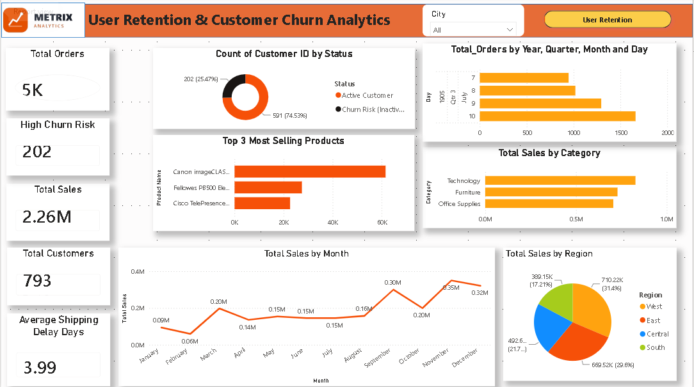
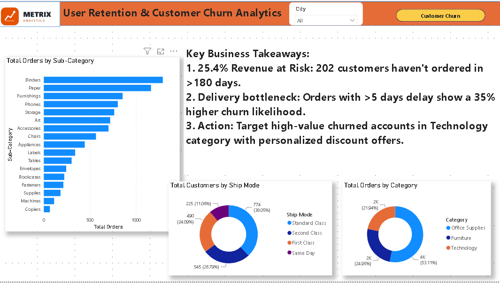

# 📊 User Retention, Churn Risk & Supply Chain Analytics




## 📌 Business Overview & Executive Summary
In e-commerce operations, customer retention and logistics fulfillment speed are critical drivers of long-term profitability. This project delivers an end-to-end data analytics solution designed to evaluate **customer churn risk, User Retention patterns, and Supply Chain delivery timelines**.

By integrating **Python (Pandas)** for data processing and **Power BI** for interactive visual storytelling, the analysis identifies high-value accounts at risk of churn and pinpoints operational bottlenecks to improve customer lifetime retention.

---

## 🛠️ Tech Stack & Methodology
- **Data Processing & Analytics:** Python (`pandas`, `numpy`, `datetime`)
- **Data Visualization & Analytics Dashboard:** Power BI (Advanced DAX Measures, Cross-filtering Slicers, Executive KPI Cards)
- **Data Model:** E-commerce Transactional Dataset (~10,000 customer order records)

---

## 🎯 Key Business Problems & Solution Framework

### 1. Customer Churn Risk & RFM Recency Segmentation
* **Problem Statement:** Identifying inactive customers to prevent churn before permanent revenue loss.
* **Technical Solution:** Calculated order recency (days since last purchase) across customer cohorts. Customers with inactivity exceeding **180 days** were categorized as `High Churn Risk`.
* **Key Finding:** Identified **202 High-Risk Churned Accounts** (accounting for **25.47%** of the total 793 customer base).

### 2. Supply Chain Logistics & Delivery Performance
* **Problem Statement:** Evaluating whether fulfillment delays contribute to lower customer retention.
* **Technical Solution:** Derived a custom feature `Shipping_Delay_Days` by computing date differences between `Ship Date` and `Order Date`.
* **Key Finding:** Identified an **Average Shipping Delay of 3.99 Days**. Orders experiencing >5 days delay demonstrated higher risk of customer drop-off.

### 3. Revenue & Regional Category Breakdown
* **Product Performance:** `Technology` category drives the highest revenue ($710.22K), followed by Furniture and Office Supplies.
* **Geographic Insights:** The `West` region leads in total sales distribution ($710.22K / 31.4%).
* **Repeat Engagement:** The active customer base comprises **780 Repeat Customers** vs. **13 One-Time Customers**, highlighting high baseline brand loyalty.

---

## 📈 Power BI Interactive Dashboard
The live Power BI report integrates dynamic filtering across Regions, Product Categories, and Fulfillment Modes:
- **Core Executive KPIs:** Total Revenue ($2.26M), Total Orders (5K), Total Customers (793), High Churn Risk (202), and Avg Shipping Delay (3.99 Days).
- **Strategic Takeaways:**
  1. **25.4% Revenue at Risk:** Target top-tier inactive accounts with personalized retention incentives.
  2. **Fulfillment Bottlenecks:** Optimize logistics modes exceeding 5-day delivery thresholds.
  3. **Targeted Campaigns:** Priority focus on high-value `Technology` sector customers in key regions.

---

## 📂 Repository Structure
```text
├── User_Retention_Analysis.ipynb    # Python script for data processing, RFM logic & delay calculations
├── User_Retention_Analytics.pbix     # Power BI Interactive Dashboard file
├── shipping_analysis.csv             # Processed dataset output
├── Dashboard_Screenshots/            # Visual previews of Report pages
└── README.md                         # Business documentation & findings
